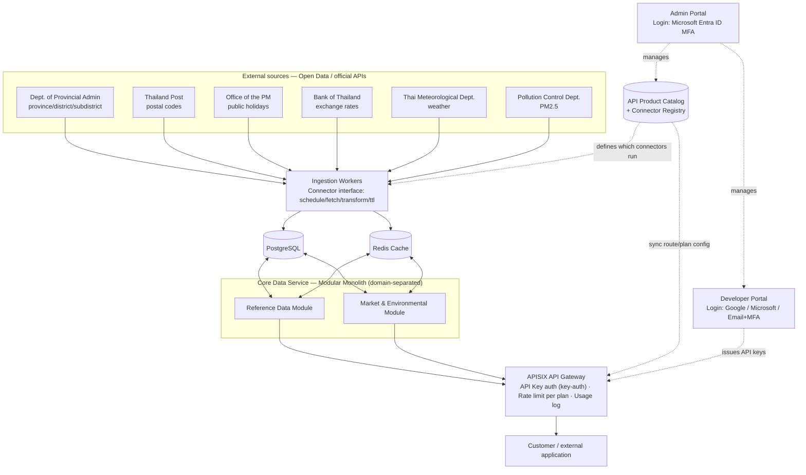

# NeurixAI Data Platform — Phase 1 Architecture

Source of truth for the design; kept in the repo so it evolves with the code instead of
drifting from it. Full interactive version (with the original diagrams) was drafted as an
artifact during design — this file is the version that lives with the code.

## Overview

Phase 1 (1–2 months) covers 6 Thai open-data domains: province/district/subdistrict,
postal codes, public holidays, BOT exchange rates, weather, PM2.5.

Backend is a **modular monolith** (not microservices) to fit the timeline, with strict
domain boundaries inside it so any domain can be extracted into its own service later
without a rewrite. **APISIX** sits in front for auth/rate-limit/usage-logging — chosen
over Kong because its etcd-backed config propagates route/consumer changes near-instantly
(this platform's Developer Portal mutates routes/keys often) and it has no Kong-style
Enterprise paywall split.

Because the plan is continuous expansion (Phase 2, 3, 4...), Phase 1 already includes an
**API Product Catalog** and **Connector Registry** so new datasets are added by
configuration, not by re-architecting.

## Architecture diagram

## Authentication

Three separate paths:

| Path | Mechanism | Why |
|---|---|---|
| Customer calling the data API | API Key (APISIX `key-auth` bound to a Consumer) | Simplest for B2B integration; rate-limit/usage log come free per key |
| Customer login to Developer Portal | Google OAuth / Microsoft OAuth / Email+Password+TOTP | Thai enterprise customers vary in identity provider |
| Staff login to Admin Portal | Microsoft Entra ID MFA (single-tenant) | Matches the company's own tenant; MFA/Conditional Access handled by Entra, not custom code |

## Designing for Phase 2+

| Principle | Mechanism | Effect |
|---|---|---|
| Connector pattern | Every source implements `schedule` / `fetch()` / `transform()` / `load()` | New dataset = new connector class, pipeline untouched |
| API Product Catalog | DB-driven registry synced into APISIX routes/consumers | New dataset = new row, not new gateway config written by hand |
| Domain boundaries in the monolith | Separate schema/module per domain, no cross-domain joins in code | Extracting a domain into its own service later is a deploy change, not a rewrite |
| Plan ↔ Product many-to-many | `plan_products` join table | Granting a plan access to a new dataset is a row insert, not a code change |

## Core schema (Milestone 0)

- `connectors`, `api_products`, `plans`, `plan_products` — the catalog/entitlement layer
- `users`, `subscriptions`, `api_keys`, `usage_logs` — portal/billing layer
- `provinces`, `districts`, `subdistricts` — first reference-data domain

`usage_logs` is append-only and expected to be high-volume; indexed on
`(api_key_id, called_at)` for now, revisit partitioning by month once volume grows —
deliberately deferred, not an oversight.

## Tech stack

| Layer | Choice | Why |
|---|---|---|
| Container runtime | Podman | Matches existing NeurixAI infra convention |
| Gateway | APISIX | See above |
| Backend | Python + FastAPI, modular monolith | Matches the existing `nuerix_api` prototype's stack; team already familiar |
| Database | PostgreSQL | Relational fit for user/subscription/catalog + reference data |
| Cache | Redis | Cache-aside in front of Postgres and external sources |
| Portal frontend (future) | Next.js/TypeScript | Matches `neurixai-nextjs` (existing company site) conventions |

## Phase 1 scope vs. deferred

**In Phase 1**: all 6 datasets, APISIX gateway with API-key auth, Developer Portal
(Google/Microsoft/Email+MFA), Admin Portal (Microsoft Entra ID MFA), simple plan tiers
wired to the Product Catalog, per-dataset caching.

**Deferred to Phase 2+**: splitting any domain into its own microservice, full automated
billing/invoicing, full observability/SLA dashboards, connectors/products beyond the
first 6.
